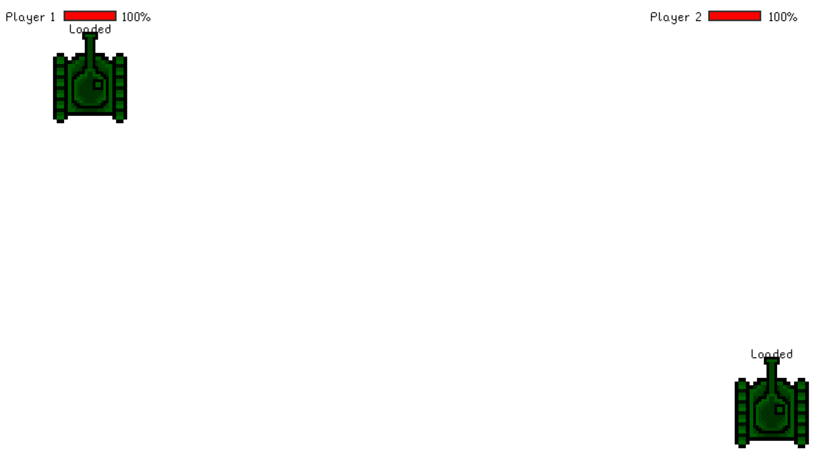
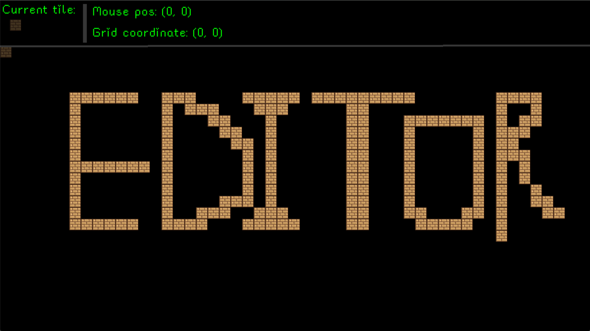

# Tank

A fast-paced, 2-player local multiplayer tank battle game featuring a built-in, real-time level editor. Built entirely in Python using the `pygame` library, this project lets you outmaneuver opponents in custom arenas that you can design and edit on the fly.


## Gameplay


## Features

### The Game
* **Local Multiplayer:** Grab a friend and play on the same keyboard.
* **Advanced Controls:** Drive your tank chassis while independently aiming your barrel for tactical shooting.
* **Pixel-Perfect Collisions:** Utilizes Pygame's mask collision system so bullets and tanks interact accurately with the environment and each other.
* **UI & Animations:** Features active health bars, dynamic reload timers, and animated firing sequences.

### The Level Editor

* **Grid-Based Snapping:** Automatically aligns placed wall tiles to a precise 30x30 pixel grid.
* **Auto-Save Functionality:** Automatically dumps your layout to `1.tilemap` every 2 seconds using background Pygame events.
* **Real-Time HUD:** Tracks and displays your live mouse coordinates, current grid position, and active tile preview.
* **Intuitive Painting:** Seamlessly paint tiles with left-click and erase mistakes with right-click.

---

## Project Structure & Asset Requirements

To run the game and the editor successfully, your directory must match the following structure:

```text
├── main.py                # The main game engine loop
├── entities.py            # Tank class, math functions, and matrix loaders
├── editor.py              # The real-time level editor script
├── 1.tilemap              # The JSON-formatted level layout (generated by the editor)
└── assets/                # Visual, UI, and cursor assets
    ├── icon.png           # Window icon
    ├── body.png           # Tank chassis sprite
    ├── barrel.png         # Tank turret/barrel sprite
    ├── bullet.png         # Projectile sprite
    ├── wall.png           # Environment tile sprite
    ├── cursor.png         # Custom mouse cursor for the editor
    ├── pixel.ttf          # Font for UI text
    └── fire/              # Folder containing 10 frames of firing animation
        ├── fire1.png
        ├── ...
        └── fire10.png
```


## Controls & Keybindings

The game features dual-stick-style controls mapped to the keyboard, allowing players to drive their tank chassis and aim their turrets independently. 

### Tank Battle (Default Layout)

| Action | Player 1 | Player 2 |
| :--- | :---: | :---: |
| **Move Forward** | `W` | `I` |
| **Move Backward** | `S` | `K` |
| **Rotate Chassis Left** | `A` | `J` |
| **Rotate Chassis Right** | `D` | `L` |
| **Rotate Turret Left** | `Q` | `U` |
| **Rotate Turret Right** | `E` | `O` |
| **Fire Main Cannon** | `Left Shift` | `;` (Semicolon) |

*Press `ESC` at any time to immediately close the game.*

### Level Editor

| Action | Input |
| :--- | :--- |
| **Place Wall Tile** | `Left Mouse Button` |
| **Erase Tile** | `Right Mouse Button` (Hover over existing tile) |
| **Exit Editor** | `ESC` (Map autosaves every 1 seconds) |

---

## Customizing Keybindings

If you want to change the default controls, you can easily do so by editing the configuration dictionaries inside `main.py`. 

Locate the `p1_controls` and `p2_controls` variables (around line 43) and swap out the Pygame key constants. For example, to change Player 1's shoot button to the Spacebar:

```python
p1_controls = {
    "forward": pygame.K_w,
    "backward": pygame.K_s,
    "left": pygame.K_a,
    "right": pygame.K_d,
    "barrel_left": pygame.K_q,
    "barrel_right": pygame.K_e,
    "shoot": pygame.K_SPACE, 
}
```